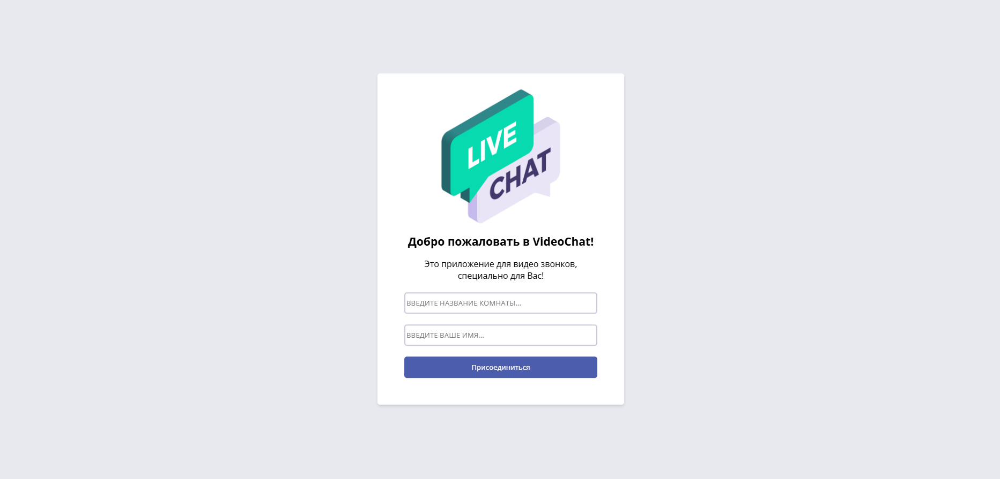
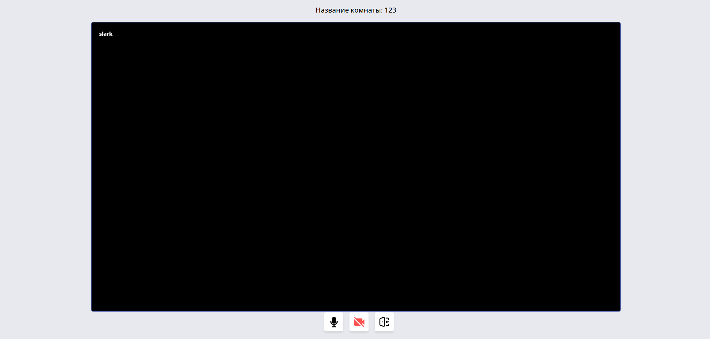
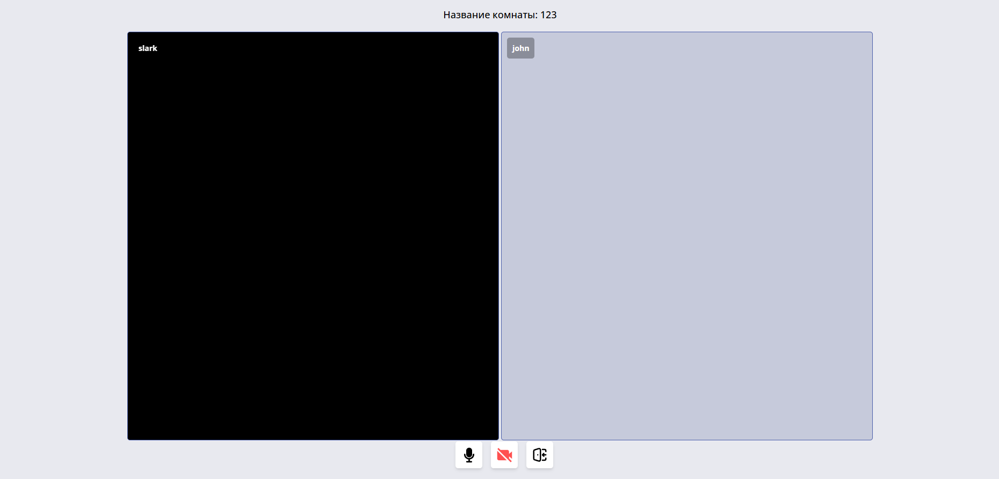

# VideoChat Application

**VideoChat** is a real-time video calling web application built with **Django** and 
**Agora RTC SDK**. It allows users to create or join video chat rooms, turn their camera 
and microphone on/off, and see other participants in real time.

### Main Page


### Videochat Page (1 user)


### Videochat Page (2 and more users)


---

## Features

- Create or join a video room by name
- Real-time audio and video streaming using Agora RTC
- Unique user IDs and tokens generated server-side
- Mute/unmute microphone and camera
- Leave room functionality
- Responsive UI with clean design
- Persistent user names in rooms using Django ORM

---

## Technologies Used

- **Backend**: Django (Python)
- **Frontend**: HTML, CSS, JavaScript (ES6+)
- **Real-Time Communication**: [Agora RTC SDK](https://api-ref.agora.io/en/video-sdk/web/4.x/index.html)
- **Styling**: Pure CSS with responsive design
- **Authentication**: Token-based (via Agora Token Builder)
- **Data Storage**: SQLite (can be upgraded to PostgreSQL, MySQL, etc.)

---

## Project Structure

```
videochat
    ├───videochat    # Project settings
    │   ├───__init__.py
    │   ├───asgi.py
    │   ├───settings.py
    │   ├───urls.py
    │   └───wsgi.py
    ├───base    # Main app
    │   ├───migrations
    │   │   └───__init__.py
    │   ├───templates
    │   │   └───base
    │   │       ├───main.html
    │   │       ├───lobby.html
    │   │       └───room.html
    │   ├───__init__.py
    │   ├───admin.py
    │   ├───apps.py
    │   ├───models.py
    │   ├───tests.py
    │   ├───urls.py
    │   └───views.py
    ├───static    # Static files
    │   ├───assets    # Agora SDK
    │   │   └───AgoraRTC_N-4.23.4.js
    │   ├───images    # Icons and logo
    │   │   ├───live-chat.png
    │   │   ├───leave.svg
    │   │   ├───mic.svg
    │   │   ├───mic-off.svg
    │   │   ├───video.svg
    │   │   └───video-off.svg
    │   ├───js    # Client-side logic
    │   │   └───streams.js
    │   ├───styles
    │   │   └───main.css
    │   └───config.json    # Agora config file
    ├───db.sqlite3    # SQLite database
    └───manage.py    # Django management script
```

---

## Agora Setup

To run this app, you need an **Agora developer account**:

1. Go to [Agora Console](https://console.agora.io/)
2. Create a project and get your:
   - `App ID`
   - `App Certificate`
3. Replace them in `static/config.json`:

```json
{
  "APP_ID": "your_app_id_here",
  "APP_CERTIFICATE": "your_app_certificate_here"
}
```

---

## How to Run Locally

1. Clone the repository:

   ```bash
   git clone https://github.com/your-username/your-repo-name.git 
   cd your-repo-name
   
2. Create and activate a virtual environment:

    ```bash
    python -m venv venv
    source venv/bin/activate  # On Windows use `venv\Scripts\activate`
   
3. Install dependencies:

    ```bash
    pip install -r requirements.txt
   
4. Apply migrations:

    ```bash
    python manage.py makemigrations
    python manage.py migrate
   
5. Run the development server:

    ```bash
    python manage.py runserver
   
6. Open your browser and go to: http://127.0.0.1:8000/

---

## Admin Panel

To access the admin panel:

1. Create a superuser:

    ```bash
    python manage.py createsuperuser
   
2. Go to: http://127.0.0.1:8000/admin

---

## How to Use

1. Enter a room name and your username
2. Click "Присоединиться" — you’ll be taken to the video room
3. Allow camera and microphone access
4. Invite others by sharing the room name
5. Use the controls to:
   - Mute/unmute microphone
   - Turn camera on/off
   - Leave the room

All users in the same room will see and hear each other in real time.
